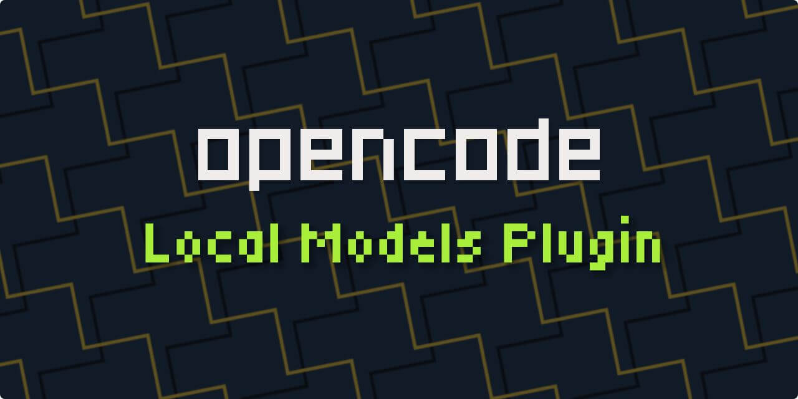
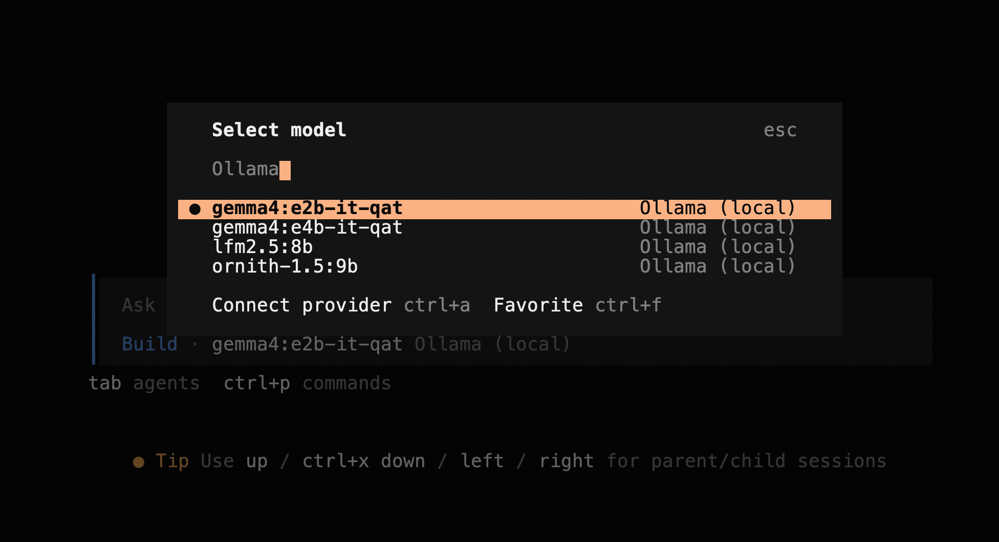

# opencode-local-models Plugin



Auto-discovers **Ollama** and **LM Studio** chat models in [opencode](https://opencode.ai)
at startup. No hardcoded model lists to keep in sync.

<details>
<summary>Why this plugin?</summary>

opencode does not discover local models for you. To use Ollama or LM Studio, you
add a provider entry and then hand-write the `models` map, one entry per model.
Every time you pull a model, remove one, or change a tag, the config goes stale.

opencode also merges in preset models from models.dev for a matching provider id.
So the `/models` picker can show entries that your engine does not actually
serve. Other plugins exist, but they usually cover one engine, generate config
files, or need a separate sync command.

This plugin does three things differently:

- It asks the live engine what is running at startup and fills the model list
  from that answer.
- It covers both Ollama and LM Studio in one plugin.
- If an engine has no chat models, the provider stays empty and does not show in
  the picker at all. You only ever see live, usable chat models.

Related reading: [opencode providers docs](https://opencode.ai/docs/providers)
</details>

## Requirements

- [opencode](https://opencode.ai) 1.18.19 or newer
- [Ollama](https://ollama.com) running on `http://localhost:11434` (optional)
- [LM Studio](https://lmstudio.ai) 0.4.21 or newer with the local server enabled (optional)

The plugin reads LM Studio's native API at `GET /api/v1/models`. That endpoint
reports each model's type and context. The OpenAI-compatible `/v1/models` endpoint
does not report those fields. Any engine can be absent. The plugin simply skips it.

## Quick start

Install the plugin into opencode's global plugins directory:

```sh
curl -fsSL https://raw.githubusercontent.com/nisrulz/opencode-local-models/v0.1.0/install.sh | bash
```

> The script copies the plugin to `~/.config/opencode/plugins/opencode-local-models.js`
and adds the `ollama` and `lmstudio` providers to `~/.config/opencode/opencode.json`.

> opencode auto-loads every file in the plugins directory when it starts, so the
plugin needs no extra config. For a project-level or manual install, see the
[install instructions](/docs/INSTALL.md).

**Restart opencode, run `/models`, and search for `ollama` or `lmstudio`. Once an
engine is running with a chat model loaded, you will see live entries like
`ollama/lfm2.5:8b`.**



> Models are discovered when opencode starts, not while it runs. If you add or
remove models on an engine, restart opencode so the picker catches up.

The release tag pins the installer and the installer defaults to that same
version. Use `--version` only when you need a different plugin version:

```sh
curl -fsSL https://raw.githubusercontent.com/nisrulz/opencode-local-models/v0.1.0/install.sh \
  | bash -s -- --version v0.2.0
```

## Docs

- [Options](/docs/OPTIONS.md)
- [Under the hood](/docs/HOW-IT-WORKS.md)
- [Development](/docs/DEV.md)

### License

[Apache License, Version 2.0](/LICENSE)
